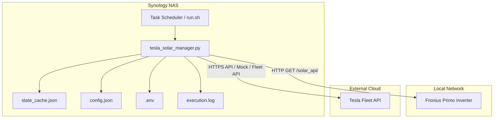

# Architecture: FreeCharge (Tesla-Fronius Solar Tracking Service)

This document maps directories, API structures, data schemas, and data flow diagrams.

---

## 🏗️ System Architecture



---

## 📂 Logical Workspace Layout
```
├── .agents/                    # Agent memory
│   ├── rules/
│   │   └── operating_protocol.md
│   ├── ACTIVE_CONTEXT.md
│   ├── ARCHITECTURE.md
│   └── LEARNINGS.md
├── .gitignore                  # Git exclusion rules
├── config.json                 # Non-sensitive config settings
├── .env                        # Sensitive secrets & environment variables (Git ignored)
├── requirements.txt            # Python dependencies
├── run.sh                      # Shell wrapper for Synology task execution
├── state_cache.json            # Local cached charger state (Git ignored)
├── tesla_solar_manager.py      # Core control script
└── tests/                      # Automated test suite
```

---

## ⚡ Data Flows & Algorithms

### 1. Solar Surplus Calculation
Let $P_{\text{grid}}$ be the active grid power from the Fronius Smart Meter.
Let $P_{\text{margin}}$ be the safety buffer (`BUFFER_WATTS`).
If `FRONIUS_EXPORT_IS_POSITIVE` is True:
$$P_{\text{surplus}} = P_{\text{grid}} - P_{\text{margin}}$$
Else:
$$P_{\text{surplus}} = -P_{\text{grid}} - P_{\text{margin}}$$

### 2. Current Scale Calculation
$$I_{\text{target}} = \min\left(I_{\text{max}}, \max\left(I_{\text{min}}, \left\lfloor\frac{P_{\text{surplus}}}{V_{\text{grid}}}\right\rfloor\right)\right)$$
Where:
- $I_{\text{min}} = 5\text{ A}$
- $I_{\text{max}} = 32\text{ A}$
- $V_{\text{grid}} = 240\text{ V}$ (default)
